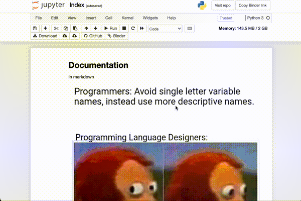

Languages
=========

Learning outcomes:

At the end of this module, students will be able to:

* Understand the difference between compiled languages, and interpreted
* know how to execute both compiled languages, and interpreted.
* be able to set up a project that imports interpreted files
  from sub-folders
* understand how interpreted languages can have REPLs
* how to use a REPL to solve a problem
  * keep trying that one line of code
  * try out an idea really quickly
* know how Notebooks interact like REPLs
  * Discuss magic numbers for files

<iframe width="560"
height="315"
src="https://www.youtube.com/embed/QRrZ3KrvV3U"
title="YouTube video player"
frameborder="0"
allow="accelerometer; autoplay; clipboard-write; encrypted-media; gyroscope; picture-in-picture"
allowfullscreen></iframe>

What's the difference
---------------------

You've seen, and used programming languages at this point in your life.
But, how they create running code differs between them. This is becoming less
and less clear as development environments get more and more fully-featured,
doing more for us.

Though, the difference of how we work and interact with them is changing, the
way the language functions, and what it might be good or bad at remains.

The difference, in short:

* Compiled: We use a program to read our source code, and it creates
  an executable program that we can run (machine code).
* Interpreted: A program reads our source code, translates it into
  machine code.

What's that mean?

### Compiled

```txt
┌─────────────┐                              ┌───────────────┐
│             │                              │               │
│             │                              │  Executable   │
│ Source Code │◄───────── Compiler ─────────►│               │
│             │ Read by             Creates  │  Machine Code │
│             │ Compiler                     │               │
└─────────────┘                              └───────────────┘
```

Selected examples of compiled langues:

* Java
* C/C++
* Rust
* Go

General flow to compile:

```bash
$ clang myProgram.c -o nowIAmExecutable
... compiles...
$ ./nowIAmExecutable
I am the program output
```

The perks of compiled languages, is that the compiler will look at
ALL the code, holistically. In doing that, it can preform
[static analysis](../4_quality_code/readme.md), removing and alerting about
unreachable code,
[can preform optimizations in code](https://gcc.gnu.org/onlinedocs/gcc/Optimize-Options.html),
and can minimize the size of the executable, among other things. This can be
modified to what your requirements are for the executable.

The **output** of the compilation is executable code. This makes the executable
non-portable - even potentially between different versions of the same
operating system.

### Interpreted

Selected examples:

* Python
* bash and other shell scripting languages
* Lua

Interpreters read in source code, and ... interprets it... into machine code.
Sometimes called "scripting" languages, as it is like a program that reads
a script (think movie script), and executes the tasks for you.

```txt
┌─────────────┐
│             │
│             │
│ Interpreter │
│             │
│             │
└─────┬───────┘
      │
    Reads
      │
      ▼
┌─────────────┐
│             │
│             │
│ Source Code │
│             │
│             │
└─────────────┘
```

The difference here is that the interpreter will take your commands, and
run them - it acts a middleware between your program, and the computer.

Consider how these programs are invoked:

```bash
$ python my_great_script.py
I am a running script
```

It literally invokes `python`, which then takes an argument, which is the
script that it is going to run.

These languages tend to be easier to write, with very expressive commands
and tools built natively into the systems. Think of `bash` having full, easy
access to the filesystem. Or `python` having `dict` for a dictionary/table
data structure always available.

But, they tend to be quirky. The 'script' is read in and executed at the
same time. So, if it hasn't read in your function, and you try to call it,
it might be 'unknown' to the system.

Also, these programming languages tend to be slower than the compiled
counterparts. There is no optimization phase in execution. The interpreter
just happily runs whatever you've provided, however you've provided it.

Scripting languages give us something nice, too. Since scripting languages
read in commands line-by-line.... we could do this in real time...

### Quirks

Since the files are *interpreted*, and therefore all the commands
are read in order, a quirk is circular imports.

This isn't an issue with compiled languages, since it views the files
holistically. Interpreted languages run into the problem of
**circular imports**:

```txt
┌──────────┐ ────────────►┌──────────┐
│ Module 1 │   Requires   │ Module 2 │
└──────────┘◄──────────── └──────────┘
```

Which, depending on your version of Python will throw an error:

```txt
AttributeError: partially initialized module 'libraries.module1' has no
attribute 'TEN' (most likely due to a circular import)
```

Or just

```txt
$ python3 main.py 
Traceback (most recent call last):
  File "main.py", line 1, in <module>
    from libraries import module1
  File "/home/cs/staff/robg/cs-tech-primer/docs/1_languages/example_code/librar
ies/module1.py", line 1, in <module>
    from . import module2
  File "/home/cs/staff/robg/cs-tech-primer/docs/1_languages/example_code/librar
ies/module2.py", line 3, in <module>
    FIFTY = 40 + module1.TEN
AttributeError: module 'libraries.module1' has no attribute 'TEN'
```

Which is slightly less useful.

The only way to fix this is to refactor your code to not have circular imports.
Or, less optimally, it is possible to change where the import is placed,
putting all the imports into the functions

```python
def moveImport():
  from . import module2
  module2.TEN
```

This.... is ugly and generally discouraged.

### REPL

Generally pronounced like 'repel', this is 'Read Execute Programming
Language'. You've seen this before, but maybe not realized that's what you've
been doing... when using a shell like `bash`.

With any REPL language, start the interpreter, and it will then wait for
your instructions. The most compelling use of this is Python:

```sh
$ python3
Python 3.8.2 (default, Apr  8 2021, 23:19:18) 
[Clang 12.0.5 (clang-1205.0.22.9)] on darwin
Type "help", "copyright", "credits" or "license" for more information.
>>> height=1
>>> width=3
>>> depth=5
>>> height*width*depth
15
>>> 
```

But also works with NodeJS, though you can see that the output
is a little different, providing feedback at every step:

```sh
% node
Welcome to Node.js v16.9.1.
Type ".help" for more information.
> height=1
1
> width=2
2
> depth=3
3
> height*width*depth
6
> 
```

Now **why would I want this**? It's actually super handy for exploration of
the language: to figure out the
syntax for a certain line of code, to see what is available in an object
provided to you, or to just hack on a line of code to make it work.

Python, for instance, you can discover what objects are in memory, and what
attributes are available.

```txt
>>> import math
>>> dir(math)
['__doc__', '__file__', '__name__', '__package__', 'acos', 'acosh', 'asin',
'asinh', 'atan', 'atan2', 'atanh', 'ceil', 'copysign', 'cos', 'cosh', 'degrees',
'e', 'erf', 'erfc', 'exp', 'expm1', 'fabs', 'factorial', 'floor', 'fmod',
'frexp', 'fsum', 'gamma', 'hypot', 'isinf', 'isnan', 'ldexp', 'lgamma', 'log',
'log10', 'log1p', 'modf', 'pi', 'pow', 'radians', 'sin', 'sinh', 'sqrt',
'tan', 'tanh', 'trunc']
```

or `help(math.floor)` will open a pager, and provide the documentation on that
attribute or function/method.

```txt
Help on built-in function floor in module math:

floor(...)
    floor(x)
    
    Return the floor of x as a float.
    This is the largest integral value <= x.
(END)
```

So, is a lot of features available in REPLs, and can help you figure out
what's happening with your code, or help you discover objects.

The next step, is built on REPL...

### Notebooks

Notebooks are a tool where you have

* documentation
* code
* results

All in one place... like a lab notebook, but one that is interactive!
These are the new hip thing in data science (which is also hip) (note to
future editors: still true? -Rob 2021)

These are interesting, in that it *is* just a REPL, but repackaged to run
**blocks** of code. These blocks can be re-run, just like using the history
in a REPL.



The blocks *can* be run out of order. Since there is program memory that is
held constant through runs of blocks, this could change your output. The
example above, a code block is re-run with `x += 1`, and it... increments `x`
every time.

This is exciting for data exploration, cleaning, and showing results - which
are key aspects of data science. Notebooks can show samples of data, plots,
and much more.

These are not useful for software development, generally, but are useful for
exploring a dataset, or prototyping an algorithm.

Strongly-typed vs Loosely-typed
-------------------------------

Though the divide between these two approximately follows the divide between
scripting languages and compiled languages, it is worth breaking this out,
because that is *not* a causal relationship.

**Strongly-typed languages** are languages where your variables have a
certain **type**, and can not change from that type. Obviously, when
Object Orientation works into this, there's a little more depth, in that
a variable must contain a certain type, or a subtype.

Consider Java:

```java
public static void main(String[] args){
  int number = 10;
  number = "Hey look at me";
}
```

This won't even compile. The error
`error: incompatible types: String cannot be converted to int` or similar
(depending on your compiler) will be thrown, and it will not create a class
file for you. This is because **int number** can only contain a number...
because we said it's an int.

But in **Loosely-typed** languages, that's not the case. Variables can hold
**whatever** we want them to. And that is a super powerful and convenient
feature! Consider this Python code:

```python
number = 10
number = "Why not"
print(number)
```

Yep, this works, runs, no problem. But, of course, this is convenient, but
can cause endless grief for us if we are sloppy. What *can* happen is that
a variable will contain a type that we are not expecting.

Consider this highly contrived example:

```python
yourWordsNotMine = input("Type something: ")

if len(yourWordsNotMine) % 2 == 0:
    yourWordsNotMine = 10

print(yourWordsNotMine.split())
```

This code will work just fine if you have an odd number of characters in your
input. But if you don't, it will spit out
`AttributeError: 'int' object has no attribute 'split'`. And, this is
because... `int` variables don't have a `split` method. But, when it's an
`str` variable, then it *does* have that method.

The tl;dr is that "don't change the type of your variable", and "don't re-use
variable names", which is an easy lesson... but a trap for both new, and
experienced users of loosely-typed languages.

### Duck typing?

Yeah, loosely-typed languages are also called "duck-typed". This is because of
the cheesy saying: "If it walks like a duck, if it talks like a duck, it must
be a duck". So, if your object has the method required, it must be the object
you want!

### Which to choose?

This is a good question early in development, but after you have an idea of
what the product is going to be. Opinions vary here, these are mine

**Loosely-typed languages** are good for:

* Short scripts (1 pagers) that solve a small problem
* Proof-of-concepts
* Glue to reshape data, passing it to other programs (maybe in a pipeline?)
* Small-to-medium sized projects

But, they have growth problems. Consider what happens if you're working with
other people.... how do they know how to use your methods/functions? The
compiler (which doesn't exist) won't tell them that they are passing the
incorrect types. The only way to make sure it's working are
thorough unit-tests/integration-tests.

**Strongly-typed languages** are good for:

* Large projects with lots of developers
* Projects that span multiple months
* Code that has to be performant

Compiled languages are... just faster. There is no interpreter layer to
slow things down.

They are predictable in terms of what is being passed in
arguments, you know what to pass in parameters. And, the compiler will kick you
in the face ~~if~~ when you get it wrong.

Activities
----------

* Change the code in `example_code` to run, removing the circular import.

TODO

* Create a python project that has circular dependencies, have the students
  fix the imports.
  Python _reads_ the files in order of import. UMLearn quiz that accepts the
  output as the 'answer'
* Have a set of libraries, have students use `python3 -i` to read the libraries,
  drop into a REPL'
* Provide a jupyter notebook with functions in the upper cells. Have students
  lego together the functions to create a result
