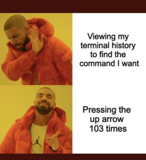
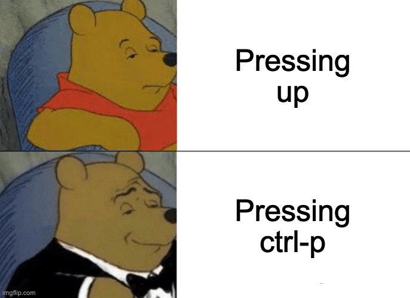

How to shell, 101
=================

An introduction to using a command-line shell. Doesn't need
to cover every command (or ... maybe that's 1 lecture).

Learning outcomes
-----------------

After doing this unit, students should be able to...

* Use a shell quickly
  * Tab completion
  * searching for previous command
* understand what a $PATH is
* add more paths to the $PATH in a .profile
* traverse a filesystem (move around a filesystem), find and execute files.
* know how to search previous commands (or, at least know it's possible, and know
  that it is probably available in their shell of choice)
* understand a unix programs inputs and outputs.

The Shell
---------

Really, a REPL environment for the `bash` (or whichever shell program you are
using). It keeps the same concepts: you have a current **state** and can run
any command to modify that state.

The most important part of the state is *where you are* on the filesystem.
Generally, you start in your home folder (aka `~`) which is usually in the
folder `/home/<your user name>`, or shared machines, you might be in something
like `/home/student/<your user name>`. This is your space! But, you'll want to
keep it tidy!

Moving around
-------------

`cd` is your friend, here. 'Change Directory' - so, move to a different
'folder' - though the usual UNIX lingo is "file" and "directory".

We can use relative paths from our current position,
or an absolute path from the root of the file system.

### Magic shell directories

* `.` this directory
* `..` previous directory. `../..` to move back directories (which you can)
  keep doing!
* `~` home folder

We can use ese any time

We can also use `~username` to move to a user's home folder

```sh
cd ~robg
```

or

```sh
pelican.cs.umanitoba.ca 136% ls ~robg/demo/
1010  1012  1020  2140  2160
```

### Relative paths

Remember, the shell is all about **state**. So, we are in a directory... which?
Use `pwd` Present Working Directory to figure that out.

Say we have the following:

```txt
pelican.cs.umanitoba.ca 123% pwd
/home/cs/staff/robg/demo
pelican.cs.umanitoba.ca 125% ls
1010  1012  1020  2140  2160
pelican.cs.umanitoba.ca 124% tree
.
├── 1010
│   └── syllabus.txt
├── 1012
│   └── syllabus.txt
├── 1020
│   └── syllabus.txt
├── 2140
│   └── syllabus.txt
└── 2160
    └── syllabus.txt

5 directories, 5 files
```

From the `pwd` command, we can see we are in `/home/cs/staff/robg/demo`,
and from the `ls` and `tree` command (which shows all the files and folders
in a neat tree format) that there are 5 directories, each with a folder in it.

We could move into `1012` by just using `cd 1012`, since we're in the `demo`
flder. Then, using relative paths, going back one `..` and then into `2140`,
by `cd ../2140`:

```txt
pelican.cs.umanitoba.ca 126% cd 1012/
pelican.cs.umanitoba.ca 127% cd ../2140
```

### Absolute paths

Absolute paths, or fully-qualified paths use a full directory path
and a file name to find a single non-ambiguous file.

First thing to know about UNIX-like operating systems is that it's a tree
(and everyone in CS loves trees).

The 'root' of the file system is the `/` directory.

```txt
pelican.cs.umanitoba.ca 128% cd /
pelican.cs.umanitoba.ca 129% ls
1     diag      lhome       misc              nvidia-modeset.ko.xz  run   usr
bin   etc       lib         mnt               nvidia-uvm.ko.xz      sbin  var
boot  home      lib64       net               opt                   srv
data  home.EL7  lost+found  nvidia-drm.ko.xz  proc                  sys
dev   import    media       nvidia.ko.xz      root                  tmp
```

We can then build paths off that. We can get to the same files as the relative
path demo:

```sh
pelican.cs.umanitoba.ca 130% cat /home/cs/staff/robg/demo/1012/syllabus.txt 
```

### Mixing them?

Yes, we can do this... no we shouldn't.

Literally, There and Back Again... going to the `demo` folder, and back to
the root `/`... and back again:

```txt
pelican.cs.umanitoba.ca 133% ls /home/cs/staff/robg/demo/1012/../../../../../../home/cs/staff/robg/demo/
```

Creating files and directories
------------------------------

Eventually, we want to fill this file system. We'll discuss moving in remote
files somewhere else, here we focus in _just making them_.

### Making directories

We can make directories fairly easily:

```sh
mkdir someFolder
```

Which uses the [permissions mask](../6_unix/permissions.md) for the default permissions
of the folder.

If you want to make a entire string of folders:

```sh
mkdir -p look/at/me/im/folder/rick
```

### Creating files

Editing files in a terminal is a larger discussion, but to just
create a file:

```sh
touch thisFile
```

`touch` is a funny program that reset the last edit date of a file...
ie, you touched it. But, it also creates the file if it does not exist.
`touch` is legitimately useful if you want a makefile to 'see' a change in a
file.

Repeating commands
------------------

Easy! Mash that up button.



Sure, that works. But it's not **smart**.

There's [a whole suite of things we can do with the history](https://www.gnu.org/software/bash/manual/html_node/Commands-For-History.html),
but I'll highlight the really useful ones here.

The gnu page uses C for 'ctrl' and M for 'meta'. Meta key is 'alt' for Windows,
and configurable on macs - often set to the 'options' key.

You should, to be a fancy person, stay on the home row. Up and down are for
scrubs.



Use ctrl-p, ctrl-n instead.

Then... we can 'modify' this behavior with the meta key to use what we've typed
as a keyword search.

Try this: start typing a command you've typed before (think a long `gcc`
command
that you *really* should have made a makefile for...) and press alt-and-p
(opt-and-p if you're on an Mac). Now, it only brings up relevant searches!

Use this! This is maybe the most useful thing you can learn to go fast!

Quick reference
---------------

Commands you'll totally forget

* `ls` - list the directories
* `cd folder_name` - move into directory `folder_name`. `cd ..` to move back
  one folder
* `pwd` - present working directory, where am I?
