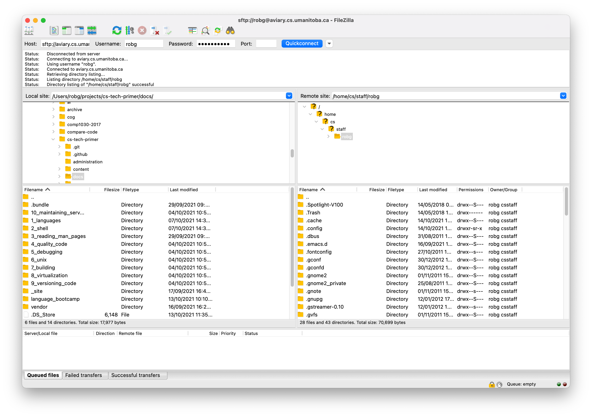

Using remote systems
====================

Generally speaking of `ssh`. But, will cover other ways to move files/edit files.

Avoiding specific software. Any time specific software is used, give a waiver
that software changes over time - and that there might be better ways,
but the idea should be approximately the same.

By the end of this module, student should be able to...

* `ssh` into a remote system, using the appropriate user name
  (`ssh bobYourUncle@system.domain`)
* use `scp` to copy the file/folder onto a remote system
* use `scp` to copy the file/folder from a remote system
* use `rsync` to copy a folder to a remote system
* use `rsync` to copy a folder from a remote system
* know why `rsync` is generally a better choice for a folder
* be able to use an FTP client to move files, open files for editing
* be able to use mobixterm (or similar) to move files, edit files
* be able to use VSCode to edit a remote file, using a plugin
* know why 'pushing to home' doesn't work
* know about VNC and other remote windowing options

The secure shell
----------------

We've talked *at length* about shells. Using a local shell sometimes feels
like more work than using a Graphical User Interface (GUI), but... what if we
only have a Command-Line Interface (CLI)?

"It'd never happen", you say? Actually, it happens all the time with machines
that we have off-premises... like, say a cloud server. Many (most?) cloud
servers are "headless", which means it has no GUI, and is a CLI-only
environment.

And, we should probably connect *securely*. Interestingly enough, this was
not always the case. `telnet` provides a command-line environment... and is
plain-text based. An old solution was also `rlogin`, which ... was also
plain-text based. `ssh` is the secure shell... which uses *encryption* to
make our communication (which include us sending a username and password)
private.

It's easy to use, too. The `man` page is intimidating though...

```text
SYNOPSIS
     ssh [-1246AaCfGgKkMNnqsTtVvXxYy] [-b bind_address] [-c cipher_spec]
         [-D [bind_address:]port] [-E log_file] [-e escape_char]
         [-F configfile] [-I pkcs11] [-i identity_file]
         [-J [user@]host[:port]] [-L address] [-l login_name] [-m mac_spec]
         [-O ctl_cmd] [-o option] [-p port] [-Q query_option] [-R address]
         [-S ctl_path] [-W host:port] [-w local_tun[:remote_tun]]
         [user@]hostname [command]
```

... that's a lot.

```sh
ssh yourUserName@the.machine.to.connect.to
```

That's the usual setup. If your username (which you can get via
`whoami`) is the same on the remote machine, you can leave off the username
part, simplifying to something like

```sh
ssh aviary.cs.umanitoba.ca
```

Getting files there
-------------------

It sounds obvious, but these things get harder to conceptualize as you're using
a CLI: when you're `ssh`ed into a remote machine, those commands run there,
and the file system you're using is there too. **Nothing** you're doing is
local.

If we are developing source files locally, we need to move them to the remote
machine for compilation and execution.

There are GUI options for moving files, but *the command line tools are faster*
because you can easily repeat a command.

`scp` for most things
---------------------

`scp` is secure copy, and securely copies a file from one place to another.
It is possible to push a file up to a remote machine, or to pull a file
from that remote machine.

The key thing is that the **remote** machine is declared using its DNS name.

```sh
scp you@aviary.cs.umanitoba.ca:~/file/on/aviary.txt .
```

A *frequent* pattern is to use the `.` to represent 'this folder'. So, the
above command pulls `aviary.txt` from the remote, and puts it into this folder
(where ever we are).

The path `~/file/on/` is pedantic, but helpful. Reminder that `~` is your home
directory, so this would go into your home directory then use the rest of the
path `file/on`, and find `aviary.txt` within there. The command

```sh
scp you@aviary.cs.umanitoba.ca:file/on/aviary.txt .
```

is semantically the same, but (to me) feels incomplete.

Or, to push a file named `hello.c`, assuming that the shell is in the same
directory as `hello.c`:

```sh
scp `hello.c` you@aviary.cs.umanitoba.ca:~/primer/
```

This will copy `hello.c` into the `primer` folder in your home
directory. Note that the `primer` folder must exist for this to be successful.

`scp` a folder structure
-------------------------

What if you have a *bunch* of files in a big directory tree that you want to
push to the remote server? Use `-r` for 'recursively' copying all the files.

```sh
scp -r myProject you@aviary.cs.umanitoba.ca:~/
```

But that takes too long
-----------------------

Oh, you have lots of files there, and you've only changed one... why push
**all** the files **all the time**.

*There's got to be a better way*.

`rsync`, the better way
------------------------

`rsync` is not installed by default on some systems, but is worth installing.
It *must* be installed on both the local and remote systems to work.

`rsync` will compare the local and remote files/file systems, and find
*changes*. Then, only update the files that have *changed*.

The general usage is `rsync -av source destination`, not unlike `scp`.
`-a` is "archive" which provides a *swath* of flags (see the `man` page),
and `-v` is verbose. I also like `--progress` if there is large files
that are being moved.

```sh
scp -av --progress cs-tech-primer you@aviary.cs.umanitoba.ca:~/tmp/
```

This is useful for large projects where you are only updating a file or
two every time.

Of course, you can pull a file from the remote system, too:

```sh
scp -av --progress you@aviary.cs.umanitoba.ca:~/cs-tech-primer .
```

Stuff it can do that you'll maybe use once
------------------------------------------

If you want to run one command, like, see what's in `/usr/bin`

```sh
ssh you@aviary.cs.umanitoba.ca ls /usr/bin
```

Common pitfall
--------------

Scenario: You're `ssh`ed into a remote machine, edited a file,
and want to have that file on your local machine, too.

Just use `scp` to send it home, right?

No.

### Why can I not `scp` a file back home?

To send a file over `scp`, you need to have an "`ssh` daemon",
or `ssh` server running. And, that server would have to be NOT blocked by a
firewall (your router).

So, there no way to send a file home to your machine from a remote
**unless you have done lots of work**. Which, is not advisable.

### So what should I do?

Open up a new terminal window, and use `scp` or `rsync` to "pull" the file
to your local machine.

But I hate CLI
--------------

*Sigh*. Fine.

`ftp` is File Transport Protocol - which... is plain-text. But, `sftp` is the
secure version, which just runs over `ssh` (using port 22 and everything).

Download an `sftp` client ([filezilla](https://filezilla-project.org/) is the
classic).



Look at all those dotfiles! They are not hidden by default, don't be surprised!

Connection information, for using `sftp` to connect to the CS network at the
U of M:

* Host: `sftp://aviary.cs.umanitoba.ca`
* Username: ... your username
* Password: .... your password
* Port: 22

Port 22 is the `ssh` port, so this clearly runs using the `ssh` protocol.

From here you can drag-and-drop files between your local file system, and
the remote file system.

Mobixterm
---------

Much like `sftp`, allows us to `ssh` in, but also drag-and-drop files between
local and remote. And, also allows us to *open and edit* files that are remote.
We can use any editor we want.

Other options
-------------

Some IDEs allow a 'remote sync', where they connect to a remote system, and
open in the IDE of choice.

This is a fast-moving solution, so this will likely be out of date quickly.

[Visual Studio Code provides this](https://code.visualstudio.com/docs/remote/ssh)
in the base install. Allowing us to connect and edit files on remote machines.

Remote Desktops
---------------

These exist! But, they tend to be laggy and finicky.

### VNC

Virtual Network Computing does not really describe what this is. VNC is a
'user impersonation' program. It lets remote users "take" the mouse and
keyboard - so the monitor (if there is one attached) would actually see the
cursor moving.

This can be installed on both Windows, Linux, and... actually almost any
machine. By default it is **wildly insecure**, but can be secured with
`ssh` tunnels or VPNs. Do your research before opening VNC to the internet.

### Remote to a Windows machine

Windows provides a service called "RDP", remote desktop protocol, on
some version of windows (usually Pro, and server). This must
be enabled manually. It allows users to use the "RDP Client" that is installed
on Windows machines. Then, if a user has an account, they can log in with their
username and password. Easy!

Many people can be connected through RDP, each getting their own desktop
environment - but this all depends on the version of Windows you have!

Activities
----------

* Give a multi-file program that depends on a library that is ONLY on aviary
  (custom one).
  Multi-file so students MUST use `scp`/`rsync`. UMLearn quiz to place the
  results.
* Have a large text file on UMLearn. Upload, change, upload - how fast is it
  to transfer using the different tools?
