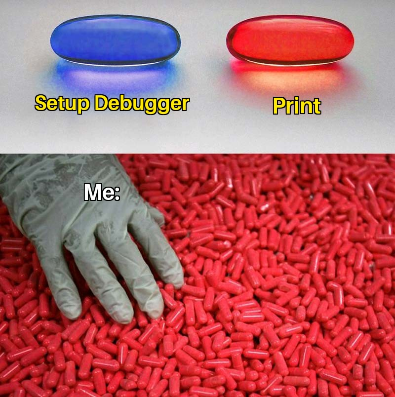

Debugging, and debuggers
========================

Show both command-line debuggers, IDE debuggers

Show some basic strategies:

* Breakpoint before the error
* Inspect variables
* Use conditional breakpoints to wait for the trigger
* Use a debugger with a unit test

By the end of this module students should be able to:

* be comfortable using a debugger.
* be able to set breakpoints, and conditional breakpoints.
* be able to inspect variables in code that is running.
* know that just using print statements in an anti-pattern.
* be able to trigger the error that is being debugged with a unit test.
* know why unit tests are better than debugging by-hand.

`printf("I am here")`
---------------------

We all start here: have a print statement to show us how our program is
executing. This can be as simple as the title of this section: showing us
that the program got to this line of code, or, maybe print out the current
state of a variable.

And, this is great! But, it doesn't scale. But learning a debugger is
*hard*, and feels like it wastes more time than you get back. Which is only
true for the first time. You **will** debug faster for the rest of your life!

That sounds like hyperbole, but it is true. As your programs get bigger, and
more advanced, the `print` method gets less and less effective. Debuggers
are the only way to really get into your running code - and learning
how to use a debugger on a smaller program earlier in your life is a great
idea.

Enough with the sales pitch
---------------------------

`print` is great, but what we actually want to do is
**stop execution**, and inspect variables at our own pace.

Debuggers are diverse in how they approach stopping code. This will lightly
cover both command-line debuggers, and GUI debuggers. The concepts are all the
same for any debugger, adn this will give you the knowledge about what is
*possible* with debuggers.

There is debuggers for (almost?) every language:

* [`pdb`](https://docs.python.org/3/library/pdb.html) for Python
* [Node.js/Javascript/Ecmascript](https://nodejs.org/api/debugger.html)
* [`gdb`](https://www.gnu.org/software/gdb/) which can debug a number of
  compiled languages, notably C, C++, Rust and Go.
* [`lldb`](https://lldb.llvm.org/) which is the clang
  derivative for compiled languages,
  and acts much like `gdb`. Debugs C, C++, Objective-C.
  There is even a
  [gdb to lldb command map](https://lldb.llvm.org/use/map.html).
* Browsers have built-in Javascript/Ecmascript debuggers!

### Breakpoints, and stepping

This is the **number one** thing we use to debug our code. We can
set breakpoints where we want our code to **stop** running, so we can inspect
our code at that point, including view the stack, so we can see
*how we got here*. We can then do a number of things.  These are the
usual names for the actions:

* Step/step in: run the next line of code. If the next line of code is a
  function call, step into that function.
* Next/step over: Run the next line of code. If it's a function call, run
  that function to its completion. So, this is the
  **next line of code in this function**.
* Continue: Just go and execute. It will stop again if/when it hits a
  breakpoint - including this breakpoint if it hits it again.

There are generally a lot more commands, but these are the key tools to
get you going.

### Conditional breakpoints

These prevent you from writing silly `if` statements to selectively stop
your code. The variety of how these work is wide, but generally, they allow
you to write a conditional to trigger the breakpoint. `x > 10` or `count == 0`.
You can use variables that are in-scope for the stack frame the breakpoint is
in.

### Watching variables

When we're stopped. We can inspect variables. If we are curious about
certain variables, we can **watch** them. This is an easy-to-get-to
list of variables we care about. We can inspect **any** variables that we are
curious to see the state of, but the watch list makes it more convenient.

Short chapter?
--------------

Maybe a little. Check out the demos - this is best seen, not read!

### C/C++

<iframe width="560"
height="315"
src="https://www.youtube.com/embed/_RMhB3ahmpM"
title="YouTube video player"
frameborder="0"
allow="accelerometer; autoplay; clipboard-write; encrypted-media; gyroscope; picture-in-picture"
allowfullscreen></iframe>

### Python

<iframe width="560"
height="315"
src="https://www.youtube.com/embed/z4I8BvCVifQ"
title="YouTube video player"
frameborder="0"
allow="accelerometer; autoplay; clipboard-write; encrypted-media; gyroscope; picture-in-picture"
allowfullscreen></iframe>

### Javascript in-browser

<iframe width="560"
height="315"
src="https://www.youtube.com/embed/ByB3JIJI6lA"
title="YouTube video player"
frameborder="0"
allow="accelerometer; autoplay; clipboard-write; encrypted-media; gyroscope; picture-in-picture"
allowfullscreen></iframe>

### Java

<iframe width="560"
height="315"
src="https://www.youtube.com/embed/T0bDHkLlhuw"
title="YouTube video player"
frameborder="0"
allow="accelerometer; autoplay; clipboard-write; encrypted-media; gyroscope; picture-in-picture"
allowfullscreen></iframe>

Activities
----------

TODO

* Python script to debug, pass as value/reference immutable issues.
* C file that has malloc issue.
* Java file with integer overflow
