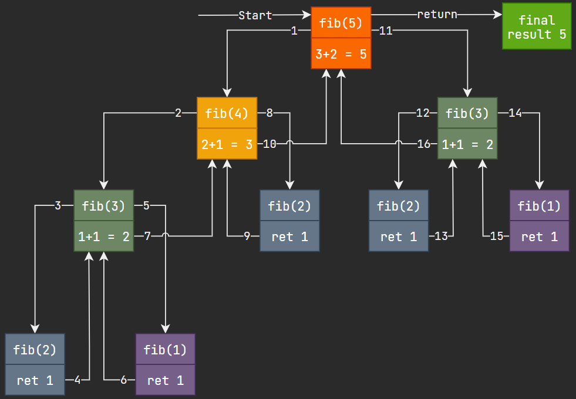

Recursion
=========

In the previous section, we briefly mentioned calling a function from within
itself. This is known as recursion.

Recursion has a general form: a base case and a recursive case. If the base case
is met, we return some value, usually a constant. In the recursive case, we call
the function again, with modified parameters.

A classic example of recursion is computing a fibonacci number. The fibonacci
sequence is `1, 1, 2, 3, 5, 8, 13, 21...` where we compute the nth fibonacci
number by adding the (n-1) and (n-2) fibonacci numbers, starting with 1 and 1.

```java
public static int fib(int n)
{
    if(n == 1 || n == 2) {
        return 1;
    }
    else {
        return fib(n - 1) + fib(n - 2);
    }
}
```

The base case is when n is 1 or 2. The recursive case is for all other positive
numbers.

This may take reading a few times. The code is very simple, but understanding
what happens at every call can be challenging. Try running through the method on
a few small values of n.

The diagram below shows what's happening when we call `fib(5)`. Follow the
numbered arrows to go through the full function call.



Notice the inefficiency of this method. We are computing `fib(3)` twice,
`fib(2)` three times and `fib(1)` twice. You will learn better techniques
for such algorithms in *COMP 2080, Analysis of Algorithms*.

More Examples
-------------

```java
// Compute base^power for power >= 0
public static int exp(int base, int power)
{
    if(power == 0) {
        return 1;
    }
    else if(power == 1) {
        return base;
    }
    else {
        return base * exp(base, power - 1);
    }
}
```

```java
// Compute n!
public static int factorial(int n)
{
    if(n <= 1) {
        return 1;
    }
    else {
        return n * factorial(n-1);
    }
}
```

Infinite Recursion
------------------

What if we didn't have a base case? What if we never arrived at a base case? We
could run into infinite recursion!

Similar to an infinite loop, infinite
recursion means we have a flaw in our program. However, unlike an infinite loop,
infinite recursion will eventually cause our program to crash. This is because
of how our programs state is stored in memory.

Each time we call a method, we "save" the state of our program and all variables
immediately before entering into the next method call.

So, if we have an infinite number of method calls and a finite amount of memory,
we must then eventually run out of memory! This is called a
***stack overflow***.

The *stack* part is in reference to the data structure used to store all these
program states, called a stack. You will learn about this data structure in
*COMP 2140, Data Structures and Algorithms*.
